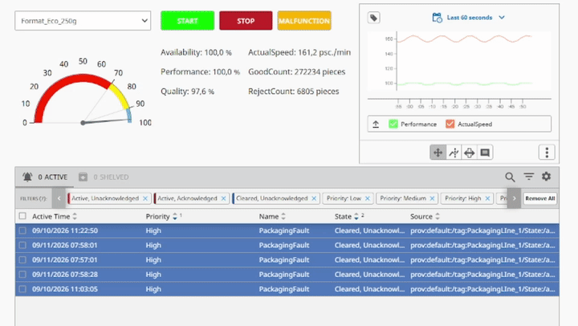

# Packaging Line SCADA / OEE

*[EN] English below · [PL] Polska wersja niżej*

## [EN] Overview

A demo SCADA/MES application for a packaging line, built in Ignition 8.3 Perspective and connected to MS SQL Server. It calculates OEE (Availability × Performance × Quality) in real time from the line state and the nominal parameters of the selected recipe.

The line is simulated: a Gateway Timer Script generates speed, piece counts and rejects. In a real deployment the same tags would come from a PLC through one of Ignition's device drivers (e.g. Allen-Bradley Logix over EtherNet/IP, or OPC UA).

## Features

- **Real-time OEE** — Availability, Performance and Quality calculated continuously from the line state and the recipe's nominal speed.
- **Recipe management** — selecting a format (250 g, 500 g, 1000 g) loads its nominal speed and reject limit from SQL Server through Named Queries.
- **Historian and trends** — actual line speed is historized and shown on a Perspective Power Chart.
- **Alarms** — Alarm Status Table with priority filtering and acknowledgment.
- **Line simulation** — Gateway Timer Script (1000 ms) producing speed variation and rejects. Fractional pieces are carried over between ticks, so the piece count stays correct at any speed.
- **Data model** — the line is a UDT instance, so another line can be added by creating a new instance.

## Stack

- Ignition 8.3 Perspective
- MS SQL Server (JDBC)
- Python / Jython (Gateway event scripts)
- User Defined Types (UDT)

## Repository structure

- `ignition_exports/Packaging_Proj.zip` — Ignition project export
- `ignition_exports/tags.json` — tag and UDT definitions
- `scripts/` — simulation script source (`Timer.py`; `SimulationTick.py` is the same logic with logging)
- `schema_and_recipes.sql` — database schema (`Recipes`, `DowntimeLog`) and recipe seed data
- `.dashboard.png`, `.packaging_demo.gif` — screenshot and demo animation

## Setup

1. Run `schema_and_recipes.sql` on your SQL Server instance.
2. In the Ignition Gateway, add a database connection named `PackagingDB` (**Config → Databases → Connections**).
3. Import `ignition_exports/tags.json` in the Tag Browser (`default` provider).
4. Import `ignition_exports/Packaging_Proj.zip` via the Gateway web UI (**Config → Projects → Import Project**).
5. Open the project in a browser or in Perspective Workstation.

---

## [PL] Opis

Demonstracyjna aplikacja SCADA/MES dla linii pakującej, wykonana w Ignition 8.3 Perspective i połączona z bazą MS SQL Server. Wylicza OEE (Dostępność × Wydajność × Jakość) w czasie rzeczywistym na podstawie stanu linii i parametrów nominalnych wybranej receptury.

Linia jest symulowana: Gateway Timer Script generuje prędkość, liczbę sztuk i odrzuty. W rzeczywistym wdrożeniu te same tagi pochodziłyby ze sterownika PLC przez jeden ze sterowników komunikacyjnych Ignition (np. Allen-Bradley Logix po EtherNet/IP albo OPC UA).

## Funkcje

- **OEE w czasie rzeczywistym** — ciągłe wyliczanie Dostępności, Wydajności i Jakości na podstawie stanu linii i prędkości nominalnej receptury.
- **Receptury** — wybór formatu (250 g, 500 g, 1000 g) pobiera prędkość nominalną i limit odrzutów z SQL Server przez Named Queries.
- **Archiwizacja i trendy** — rzeczywista prędkość linii jest archiwizowana i wyświetlana na wykresie Power Chart.
- **Alarmy** — Alarm Status Table z filtrowaniem po priorytecie i potwierdzaniem.
- **Symulacja linii** — Gateway Timer Script (1000 ms) generujący zmiany prędkości i odrzuty. Ułamkowe części sztuk są przenoszone między cyklami, więc licznik jest poprawny przy każdej prędkości.
- **Model danych** — linia jest instancją UDT, więc kolejną linię dodaje się, tworząc nową instancję.

## Technologie

- Ignition 8.3 Perspective
- MS SQL Server (JDBC)
- Python / Jython (skrypty zdarzeń Gateway)
- User Defined Types (UDT)

## Struktura repozytorium

- `ignition_exports/Packaging_Proj.zip` — eksport projektu Ignition
- `ignition_exports/tags.json` — definicje tagów i UDT
- `scripts/` — kod skryptu symulacji (`Timer.py`; `SimulationTick.py` to ta sama logika z logowaniem)
- `schema_and_recipes.sql` — schemat bazy (`Recipes`, `DowntimeLog`) i dane startowe receptur
- `.dashboard.png`, `.packaging_demo.gif` — zrzut ekranu i animacja demonstracyjna

## Uruchomienie

1. Uruchom `schema_and_recipes.sql` na instancji SQL Server.
2. W Ignition Gateway dodaj połączenie z bazą o nazwie `PackagingDB` (**Config → Databases → Connections**).
3. Zaimportuj `ignition_exports/tags.json` w Tag Browserze (provider `default`).
4. Zaimportuj `ignition_exports/Packaging_Proj.zip` przez interfejs WWW Gateway (**Config → Projects → Import Project**).
5. Otwórz projekt w przeglądarce albo w Perspective Workstation.
